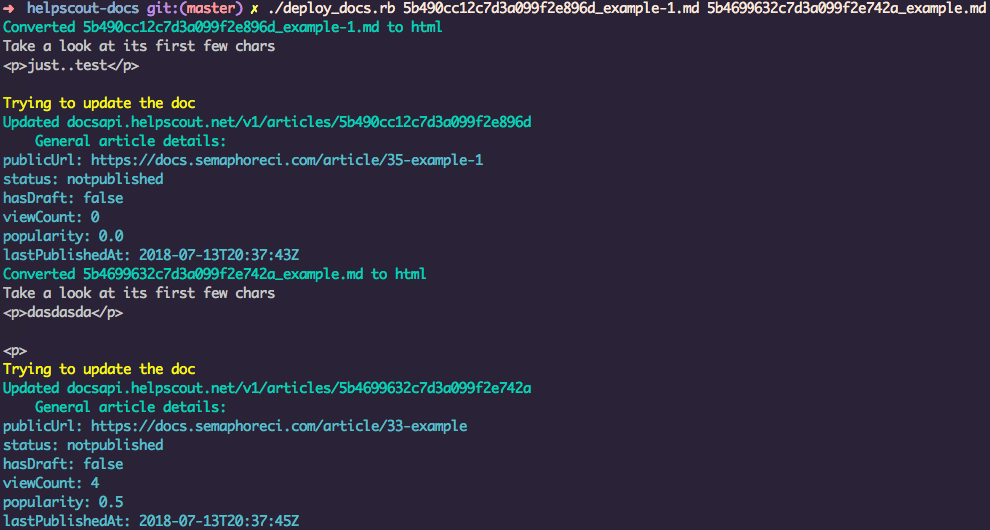

HelpScout Docs
---

## Usage

### Creating new file

- create a file in HelpScout docs
  - HelpScout will assign a URL to it which we'll use for next step (`https://docs.semaphoreci.com/article/33-example?preview=5b4699632c7d3a099f2e742a`)
- create file in repository `5b4699632c7d3a099f2e742a_example.md`
  - `5b4699632c7d3a099f2e742a` is `id` of specific article
  - `example` is article's `slug`

### Updating existing files

#### Update specific files

#### Update all files

When [HelpScout Docs token] is in place, executing `deploy_docs.rb` script will
[update] every article which meets the following:

- It is in the project root directory
- It is a markdown file associated with an article in HelpScout Docs
- It is named in the following form `21323321_article-name.md`.
  - `21323321` in this example represents `id` of article in HelpScout Docs
  - `id` is included in the article's URL (`https://secure.helpscout.net/docs/xxxxxxx/article/21323321/`)

### Install dependencies

Currently, script depends on gem [kramdown]. It can be installed with the following command

`gem install kramdown`

### Set up secret

- `cp docs_secrets.yml.example docs_secrets.yml`
- update this file with your HelpScout Docs API Key

### Set up project on Semaphore

- add project to an org with `sem`
- propagate secret to Semaphore with `sem`

[HelpScout Docs token]: https://developer.helpscout.com/docs-api/
[kramdown]: https://kramdown.gettalong.org/index.html
[update]: https://developer.helpscout.com/docs-api/articles/update/
